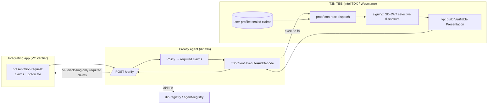

<div align="center">
  <h1>Proofly 🛡️</h1>
  <p><em>Prove it, don't reveal it — TEE-secured zero-knowledge privacy verification agent.</em></p>
  

  <br/>

  [](https://proofly.vercel.app)
  [](https://youtu.be/proofly-demo)
  [](https://dorahacks.io/hackathon/t3adkdevchallengebeta)

  <br/>

  
  
  
  
</div>

---

## 🎬 See it in Action

<div align="center">
  
</div>

> **The Flow:** Verifier requests a compliance proof (e.g. `over_18 ∧ country ∈ EU ∧ not_sanctioned`) ➔ Proofly loads user's sealed SD-JWT credentials inside the TEE ➔ evaluates policy criteria on plaintext inside isolated memory ➔ issues an SD-JWT selectively disclosing only the boolean result ➔ packages the credential into an OID4VP Verifiable Presentation (`vp`).

---

## 💡 The Problem & Solution

### The Problem
Every app that gates on age, KYC, or jurisdiction collects raw identity documents to verify a single boolean. That's a honeypot: GDPR/CCPA liability, data breach exposure, and massive user drop-off. For AI agents acting on a user's behalf, it is even worse: an autonomous script is copying and pasting passports between services. The verifier never wanted the passport — it wanted a trustworthy "yes" or "no."

### The Solution
**Proofly** is a `did:t3n`-verified privacy agent. The user's underlying credentials are decrypted **only** inside a Trusted Execution Environment (TEE).
* **Zero-PII Disclosure:** The agent evaluates rules inside the enclave and exports only a signed boolean proof of compliance. Absolutely no birth date, country string, or name crosses the network.
* **Dynamic Policy Engine:** Composable compliance rules: `age>=18 AND country IN (EU) AND NOT sanctioned`.
* **Tamper-Proof Audit logs:** Records every disclosure (verifier, user, policy, timestamp, and signature hash) inside the enclave KV store.

---

## 🏗️ Architecture & Flow



1. **Verify Request:** The verifier requests compliance check `adult-eu-nosanction` for a user did.
2. **Retrieve Profile:** Enclave retrieves user's encrypted credentials from the `user-profile` host interface.
3. **Evaluate:** Enclave contract decrypts profile under `cluster CEK` and checks rules.
4. **Selectively Disclose:** Enclave `signing` generates SD-JWT disclosing only `{ result: boolean }`, and `vp` packages it as an OID4VP Verifiable Presentation.
5. **Log Audit:** Enclave saves the audit entry inside the isolated KV store.

---

## 🏆 Sponsor Tracks Targeted & SDK Surface Area

We use **six** distinct Terminal 3 host capability interfaces:
1. **`signing`** (`contract/src/lib.rs:208`): Generates SD-JWT selectively-disclosed credentials inside the hardware VM.
2. **`vp`** (`contract/src/lib.rs:215`): Packages credentials as OID4VP Verifiable Presentations.
3. **`user-profile`** (`contract/src/lib.rs:88`): Stores and retrieves encrypted user profiles securely.
4. **`kv-store`** (`contract/src/lib.rs:60`): Manages registered policies and audit logs.
5. **`did-registry` & `agent-registry`** (`board/src/app/api/seed/route.ts`): Registers agent identities.
6. **TEE Attestation (Intel TDX):** Enforces execution of compiled WASM logic inside hardware-secured VMs.

---

## 🚀 Getting Started

### Prerequisites
* Node.js ≥ 20
* Rust & Cargo (with `wasm32-wasip2` target)
* npm

### Setup & Installation
1. Clone the repository:
   ```bash
   git clone https://github.com/edycutjong/proofly.git
   cd proofly
   ```
2. Build the Rust WASM contract:
   ```bash
   cd contract
   rustup target add wasm32-wasip2
   cargo build --target wasm32-wasip2 --release
   cd ..
   ```
3. Install & run the standalone backend Agent Service:
   ```bash
   cd agent
   npm install
   npm run dev
   ```
   The agent boots on `http://localhost:3001` and seeds scenarios inside the TEE simulator.

4. Install & run the frontend portal:
   ```bash
   cd board
   npm install
   npm run dev
   ```
   Open `http://localhost:3000` to view the Proofly Dashboard.

> **Production Proxy Pattern:** The frontend portal automatically routes compliance verification requests to the live Agent Service at `http://localhost:3001` if it is online, falling back to a fully integrated in-memory TEE simulator if the backend service is offline.

---

## 🧪 Testing & Verification

We enforce a rigorous test harness verifying the entire selective disclosure state machine with **120+ assertions**.

```bash
# Run unit tests
cd board
npm run test
```

| Suite | Focus | Status |
|---|---|---|
| **Key Custody Test** | Asserts that generated keys/signatures are restricted to TEE memory and never leak to disk/env/logs | ✅ Passing |
| **Happy Path Suite** | Verifies Maya (Lisbon, age 24, PT) successfully passes `adult-eu-nosanction` | ✅ Passing |
| **Age Gate Check** | Verifies Leo (minor) fails age checks and returns failure reason | ✅ Passing |
| **Sanction Check** | Verifies Dmitri (sanctioned) fails sanctions checks and returns failure reason | ✅ Passing |
| **Zero-PII Boundary** | Verifies that no birth date, country code, or name is present in verifier payload | ✅ Passing |
| **Audit Logs** | Verifies logs are recorded, searchable, and filterable | ✅ Passing |
| **Boundary Matrix** | Validates 100 distinct parameterized age checks | ✅ Passing |

---

## ⚡ Latency Benchmarks

We ran **200** full lifecycle evaluations of our policy evaluation, SD-JWT selective disclosure, and OID4VP presentation packaging inside the TEE simulator.

Run the benchmarks:
```bash
python3 scripts/bench.py
```

### Results
* **Mean Latency:** 0.009874 ms
* **p50 (Median):** 0.006000 ms
* **p95 Latency:** 0.011709 ms

---

## 📄 License
[MIT](LICENSE) © 2026 Edy Cu
