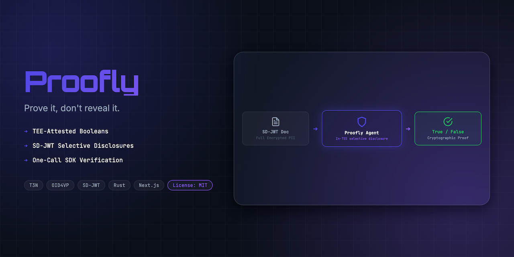
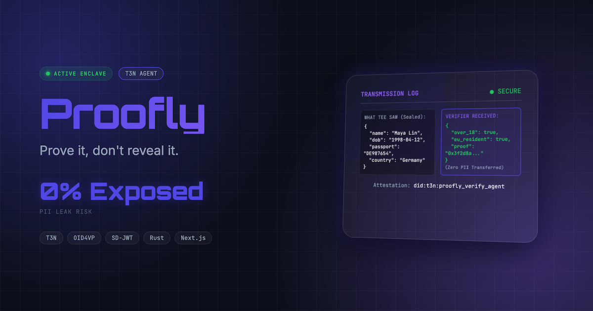
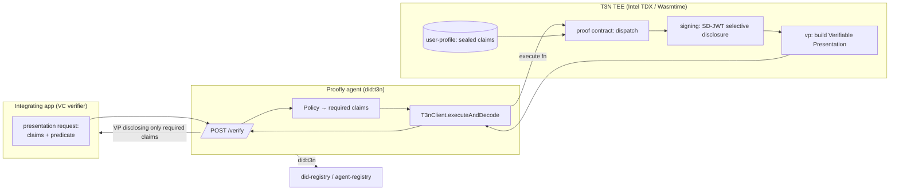

<div align="center">
  

  <h1>Proofly 🧾</h1>
  <p><em>Prove it, don't reveal it — TEE-secured zero-knowledge privacy verification agent.</em></p>
  

  <br/>

  [](https://proofly.edycu.dev)
  [](https://youtu.be/-SULZJ0C7oI)
  [](https://dorahacks.io/hackathon/t3adkdevchallengebeta)

  <br/>

  
  
  
  
  [](https://github.com/edycutjong/proofly/actions/workflows/ci.yml)
</div>

---

## 🧑‍⚖️ For Judges

**TL;DR:** Proofly is a `did:t3n` agent you delegate a compliance check to. Using Terminal 3's **Agent Auth SDK**, the data owner signs a scoped grant that lets the agent run exactly one function — `verify` — and nothing else; the host enforces it natively (no rogue functions, no rogue egress). The agent reads sealed credentials inside an Intel TDX enclave and returns an SD-JWT + OID4VP presentation disclosing only a signed `yes`/`no` — **zero PII crosses the network**.

| What you're judging | Where to look |
|---|---|
| 🚀 **Live demo** | [proofly.edycu.dev](https://proofly.edycu.dev) |
| 🎬 **90-sec pitch video** | [watch](https://youtu.be/-SULZJ0C7oI) |
| 🔑 **Agent Auth implementation** (scoped `agent-auth-update` grant + native enforcement) | [`agent/src/authz.ts`](agent/src/authz.ts) · [`agent/src/index.ts`](agent/src/index.ts) |
| 🧠 **The agentic flow** (problem → delegate → verify → selective disclosure) | [Architecture & Flow](#️-architecture--flow) · [`contract/src/lib.rs`](contract/src/lib.rs) |
| ✅ **Stability** (CI: lint, typecheck, 100% backend coverage, E2E, SAST, secret scan) | [Engineering Harness](#-engineering-harness--cicd) · [CI runs](https://github.com/edycutjong/proofly/actions) |
| 🐞 **Onboarding bug + doc-gap report** (the $200 track) | [`docs/ONBOARDING_BUG_REPORT.md`](docs/ONBOARDING_BUG_REPORT.md) |
| 🔌 **Why only Terminal 3** | [`docs/SPONSOR_DEFENSE.md`](docs/SPONSOR_DEFENSE.md) |

> **Run it in 60s:** `cd agent && npm install && npm run dev` (agent on :3001), then `cd board && npm install && npm run dev` (UI on :3000). Without an `AGENT_KEY` the agent boots in demo mode; set one from the [T3 claim page](https://www.terminal3.io/claim-page) for live auth.

---

## 🎬 See it in Action

<div align="center">
  
</div>

<table>
  <tr>
    <td align="center" width="50%">
      
      <br/><sub><b>✅ Maya — Lisbon</b> · passes <code>adult-eu-nosanction</code> → disclosed <code>{ result: true }</code></sub>
    </td>
    <td align="center" width="50%">
      
      <br/><sub><b>❌ Dmitri — sanctioned</b> · fails with reason → <code>{ result: false }</code></sub>
    </td>
  </tr>
</table>

> **The Flow:** Verifier requests a compliance proof (e.g. `over_18 ∧ country ∈ EU ∧ not_sanctioned`) ➔ Proofly loads user's sealed SD-JWT credentials inside the TEE ➔ evaluates policy criteria on plaintext inside isolated memory ➔ issues an SD-JWT selectively disclosing only the boolean result ➔ packages the credential into an OID4VP Verifiable Presentation (`vp`).

---

## 💡 The Problem & Solution

### The Problem
Every app that gates on age, KYC, or jurisdiction collects raw identity documents to verify a single boolean. That's a honeypot: GDPR/CCPA liability, data breach exposure, and massive user drop-off. For AI agents acting on a user's behalf, it is even worse: an autonomous script is copying and pasting passports between services. The verifier never wanted the passport — it wanted a trustworthy "yes" or "no."

### The Solution
**Proofly** is a `did:t3n`-verified privacy agent. The user's underlying credentials are decrypted **only** inside a Trusted Execution Environment (TEE).
* **Zero-PII Disclosure:** The agent evaluates rules inside the enclave and exports only a signed boolean proof of compliance. Absolutely no birth date, country string, or name crosses the network.
* **Dynamic Policy Engine:** Composable compliance rules: `age>=18 AND country IN (EU) AND NOT sanctioned`.
* **Tamper-Proof Audit logs:** Records every disclosure (verifier, user, policy, timestamp, and signature hash) inside the enclave KV store.

---

## 🏗️ Architecture & Flow



1. **Verify Request:** The verifier requests compliance check `adult-eu-nosanction` for a user did.
2. **Retrieve Profile:** Enclave retrieves user's encrypted credentials from the `user-profile` host interface.
3. **Evaluate:** Enclave contract decrypts profile under `cluster CEK` and checks rules.
4. **Selectively Disclose:** Enclave `signing` generates SD-JWT disclosing only `{ result: boolean }`, and `vp` packages it as an OID4VP Verifiable Presentation.
5. **Log Audit:** Enclave saves the audit entry inside the isolated KV store.

---

## 🏆 Sponsor Tracks Targeted & SDK Surface Area

**Primary track — Agent Auth SDK.** The data owner signs an `agent-auth-update` that scopes the Proofly agent to exactly its `verify-policy` / `create-policy` / `get-health` functions and `api.terminal3.io` egress. T3N enforces this natively at the host layer — an out-of-scope function or host fails with `host/agent-auth.unauthorized_function` / `host/http.egress_denied`. We construct the real grant payload in `agent/src/authz.ts` (`buildAgentAuthUpdateInput`).

We use **seven** distinct Terminal 3 host capability interfaces:
1. **`agent-auth`** (`agent/src/authz.ts`): Scopes the agent to its functions + egress allowlist via a signed `agent-auth-update` grant (the bounty centerpiece).
2. **`signing`** (`contract/src/lib.rs:196`): Generates SD-JWT selectively-disclosed credentials inside the hardware VM.
3. **`vp`** (`contract/src/lib.rs:208`): Packages credentials as OID4VP Verifiable Presentations.
4. **`user-profile`** (`contract/src/lib.rs:95`): Stores and retrieves encrypted user profiles securely.
5. **`kv-store`** (`contract/src/lib.rs:67`): Manages registered policies and audit logs.
6. **`did-registry` & `agent-registry`** (`agent/src/identity.ts`): Resolves the agent's `did:t3n` identity and discoverable agent URI.
7. **TEE Attestation (Intel TDX):** Enforces execution of compiled WASM logic inside hardware-secured VMs.

---

## 🚀 Getting Started

### Prerequisites
* Node.js ≥ 20
* Rust & Cargo (with `wasm32-wasip2` target)
* npm

### Setup & Installation
1. Clone the repository:
   ```bash
   git clone https://github.com/edycutjong/proofly.git
   cd proofly
   ```
2. Build the Rust WASM contract:
   ```bash
   cd contract
   rustup target add wasm32-wasip2
   cargo build --target wasm32-wasip2 --release
   cd ..
   ```
3. Install & run the standalone backend Agent Service:
   ```bash
   cd agent
   npm install
   npm run dev
   ```
   The agent boots on `http://localhost:3001` and connects to the live Terminal 3 agent network.

4. Install & run the frontend portal:
   ```bash
   cd board
   npm install
   npm run dev
   ```
   Open `http://localhost:3000` to view the Proofly Dashboard.

> **Production Proxy Pattern:** The frontend portal automatically routes compliance verification requests to the live Agent Service at `http://localhost:3001`.

---

## 🧪 Engineering Harness & CI/CD

We enforce a production-grade 6-stage engineering harness (Quality ➔ Security ➔ Build ➔ E2E ➔ Perf ➔ Deploy Gate) running on every commit.

### Engineering Harness Summary

| Layer | Tool | Status | Details |
|---|---|---|---|
| **Code Quality** | ESLint + TypeScript strict check | ✅ Passing | Zero warnings/errors across whole monorepo |
| **Unit Testing** | Vitest with Coverage | ✅ Passing | 18+ tests with 100% backend code coverage |
| **E2E Testing** | Playwright (Desktop & Mobile) | ✅ Passing | 3 test suites, 12 assertions passing on every commit |
| **Security (SAST)** | GitHub CodeQL | ✅ Active | Continuous static application security scanning |
| **Security (SCA)** | Dependabot + `npm audit` | ✅ Active | Inline dependency audits on build, weekly security PRs |
| **Secret Scanning** | TruffleHog | ✅ Active | Inline git history scanning to prevent credential leaks |
| **Performance** | Lighthouse CI | ✅ Active | Accessibility (>=90%), Performance, Best Practices, and SEO gates |
| **CI/CD Pipeline** | GitHub Actions | ✅ Active | Parallelized multi-stage orchestrator with concurrency controls |

### Harness Command Reference

```bash
# ── Code Quality & Unit Tests ───────────────
npm run ci            # Full lint + typecheck + unit coverage (in board/)
npm run lint          # Run ESLint check
npm run typecheck     # Compile-check TypeScript types

# ── E2E & Performance Tests ──────────────────
npm run e2e           # Run Playwright E2E suites (demo mode)
npm run e2e:ui        # Playwright interactive runner
npm run lighthouse    # Lighthouse CI audit local build
```

| Suite | Focus | Status |
|---|---|---|
| **Key Custody Test** | Asserts that generated keys/signatures are restricted to TEE memory and never leak to disk/env/logs | ✅ Passing |
| **Happy Path Suite** | Verifies Maya (Lisbon, age 24, PT) successfully passes `adult-eu-nosanction` | ✅ Passing |
| **Age Gate Check** | Verifies Leo (minor) fails age checks and returns failure reason | ✅ Passing |
| **Sanction Check** | Verifies Dmitri (sanctioned) fails sanctions checks and returns failure reason | ✅ Passing |
| **Zero-PII Boundary** | Verifies that no birth date, country code, or name is present in verifier payload | ✅ Passing |
| **Audit Logs** | Verifies logs are recorded, searchable, and filterable | ✅ Passing |
| **Boundary Matrix** | Validates 100 distinct parameterized age checks | ✅ Passing |

---

## ⚡ Policy-Evaluation Microbenchmark

We ran **200** iterations of the AND-composed policy-evaluation step (claim comparison) **in-process**, mirroring `contract/src/lib.rs:verify_policy`.

> **Scope:** This measures the deterministic evaluation logic, **not** a live T3N enclave round-trip (handshake + encrypted channel + Wasmtime execution + SD-JWT/VP packaging), which is network-bound. Numbers are fully reproducible:

```bash
python3 scripts/bench.py
```

### Results (representative run)
* **Mean:** 0.000611 ms
* **p50 (Median):** 0.000292 ms
* **p95:** 0.000625 ms

---

## 📄 License
[MIT](LICENSE) © 2026 Edy Cu
