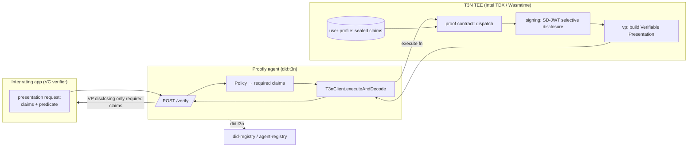

# ARCHITECTURE — Proofly

> API verified against `docs.terminal3.io`. Selective disclosure on T3N is **SD-JWT VCs + Verifiable Presentations (OID4VP)**, not a "PRIVATE_DATA_PROCESSING" tool; identity is `did:t3n` via the `did-registry`/`agent-registry` host interfaces, not ERC-8004.

## Tech Stack
- **Client/orchestration:** TypeScript + `T3nClient` (ADK) — `handshake()`, `authenticate(createEthAuthInput(addr))`, `executeAndDecode()`
- **Proof contract:** Rust → WASM component (`wasm32-wasip2`), entry `dispatch()`
- **Identity:** `did:t3n` (`did-registry`), agent published via `agent-registry`
- **Selective disclosure:** `vp` host iface (Verifiable Presentations / OID4VP) + `signing` (SD-JWT VC issuance) + `user-profile` (sealed PII)
- **Last-mile (optional):** `http-with-placeholders` (`{{profile.*}}`) to hand a verified field to a third party without the contract seeing plaintext
- **Verifier app + portal:** Next.js + Tailwind
- **Tests:** Vitest

## System Diagram


## Core flow
1. Verifier sends a **presentation request** (`claims: [over_18]`, or predicate `age>=18`).
2. Proofly maps it to required claims, calls its proof **contract** in the TEE.
3. Contract reads the user's **sealed SD-JWT VC** (`user-profile`), and via `signing` discloses **only** the requested claim(s); `vp` wraps it as an **OID4VP Verifiable Presentation**.
4. Verifier receives the VP — selectively disclosing `over_18: true` (or the predicate result) and **nothing else**. The contract itself only ever handled the sealed credential inside the enclave.

The security claim is T3N's: claims live encrypted (`cluster CEK`), decrypt **only inside the attested TEE**, and SD-JWT discloses a single field — the verifier never receives the birth date, name, or document.

## Data Model
```ts
type ClaimReq = { claim: 'age'|'country'|'kyc'|'sanctioned'; op?: '>='|'in'|'=='|'not'; value?: string|string[] }
type Policy   = { id: string; require: ClaimReq[] }           // AND-composed (MVP)
type Presentation = { vp: string /* OID4VP */; disclosed: Record<string, unknown>; ts: number }
type AuditEntry = { verifier: string; userDid: string; policyId: string; disclosed: string[]; ts: number }
```

## API
| Method | Path | Returns |
|---|---|---|
| POST | `/verify` `{ userDid, policyId }` | `Presentation` (OID4VP VP, minimal disclosure) |
| POST | `/policies` `Policy` | `{ id }` |
| GET | `/audit?verifier=` | `AuditEntry[]` |
| GET | `/health` | `{ agentDid, registry: 'ok' }` |

## Model Selection
No ML on the hot path — disclosure is cryptographic (SD-JWT/VP), not inferential. Optional Claude Haiku **at config time only** to compile a natural-language rule ("adult EU resident, not sanctioned") into a `Policy`. Keeping inference off the disclosure path is a stability + auditability choice.

## Host interfaces used (real, ≥3)
`vp` · `signing` (SD-JWT) · `user-profile` · `did-registry`/`agent-registry` · `agent-auth` (scopes Proofly to its verify functions). `http-with-placeholders` for the optional last-mile.

## Boilerplate
No registry match → `npx create-next-app` (portal) + a Rust contract crate (`wasm32-wasip2`, `wit-bindgen 0.49`) for the proof logic.
